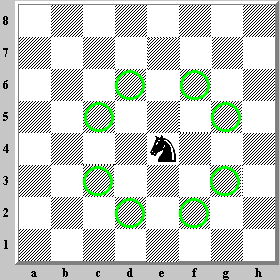

# Backtracking Algorithm
----------------------
## Knight chess


picture from:http://www.mark-weeks.com/aboutcom/ble132kn.htm

```
If all squares are visited
    print the solution
Else
   a) Add one of the next moves to solution vector and recursively
   check if this move leads to a solution. (A Knight can make maximum
   eight moves. We choose one of the 8 moves in this step).
   b) If the move chosen in the above step doesn't lead to a solution
   then remove this move from the solution vector and try other
   alternative moves.
   c) If none of the alternatives work then return false (Returning false
   will remove the previously added item in recursion and if false is
   returned by the initial call of recursion then "no solution exists" )
```
```[language=python]
import numpy as np

n = 6


def is_safe(chessboard, x, y):
    if -1 < x < n and -1 < y < n:
        if chessboard[x, y] == -1:
            return True
        else:
            return False


def chessboard_print(chessboard):
    print(chessboard)


def find(steps, x, y, chessboard, x_move, y_move, n):
    if steps == n*n:
        return True
    for i in range(len(x_move)):
        next_x = x+x_move[i]
        next_y = y+y_move[i]
        if is_safe(chessboard, next_x, next_y):

            chessboard[next_x, next_y] = steps
            chessboard_print(chessboard)
            if find(steps+1, next_x, next_y, chessboard, x_move, y_move, n):
                return True
            else:
                chessboard[next_x, next_y] = -1
                next_x = next_x-x_move[i]
                next_y = next_y-y_move[i]
    return False


def solve():
    chessboard = np.zeros((n, n))
    for i in range(n):
        for j in range(n):
            chessboard[i, j] = -1
    chessboard[0, 0] = 0
    x_move = [2, 1, -1, -2, -2, -1,  1,  2]
    y_move = [1, 2,  2,  1, -1, -2, -2, -1]
    if find(1, 0, 0, chessboard, x_move, y_move, n):
        chessboard_print(chessboard)
    else:
        print("Solution does not exist")


if __name__ == "__main__":
    print("Runing")
    solve()
    print("stop")
```
However, the time complexity is $O(8^{N*N})$, so do not try on your computer.

We can optimize the algorithm by lookfowarding two steps:
- when you are going to excute next step,count the next step's next step amount
- sort the possiable steps, and try the big count direction

It will decrease the step of backtrack.

## Minimax Algorithm


Summarize from：http://www.geeksforgeeks.org/backtracking-algorithms/
